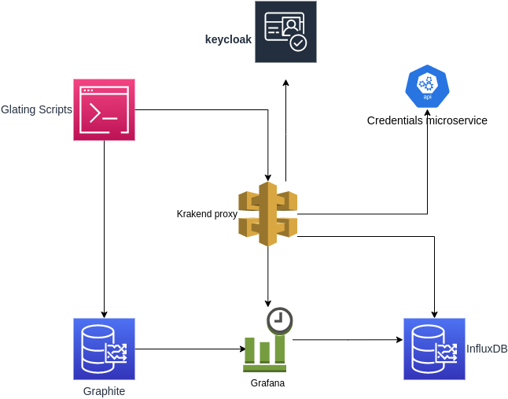

# Getting Started

### Component Information
* **keycloak**:
Identity and Access Management component, use to handle the authentication and authorization.  
Component run as docker container and execute with a docker compose, The configuration
is on deploy/docker-compose-infra-structure.yml.
    #### keycloak's URL [http://localhost:8081](http://localhost:8081/)

* **krakend**: 
Api gateway component, used to handle all traffic to all the components. 
Component run as docker container and execute with a docker compose, The configuration 
is on deploy/docker-compose-infra-structure.yml.
    #### krakend's URL [http://localhost:8080](http://localhost:8080/) 

* **Grafana**:
Visualization web application, used to show data and monitoring the platform.
Component run as docker container and execute with a docker compose, The configuration
is on deploy/docker-compose-infra-structure.yml.
  #### Grafana's URL [http://localhost:3000/](http://localhost:3000/)

* **Graphite**:
Monitoring tool, used to storage the data from gatling load testing.
Component run as docker container and execute with a docker compose, The configuration
is on deploy/docker-compose-infra-structure.yml.
  #### Graphite's URL [http://localhost/](http://localhost/)

* **InfluxDb**:
Monitoring tool, used to storage the metrics collected by the krakend.
Component run as docker container and execute with a docker compose, The configuration
is on deploy/docker-compose-infra-structure.yml.

| App                  | Port        | Description |
|----------------------|-------------|-------------|
| keycloak             | 8081        |             |
| krakend              | 8080 & 8090 |             |
| Grafana              | 3000        |             |
| Graphite             | *           |             |
| InfluxDb             | 8086        |             |
| general microservice | 8889        |             |

https://www.testcontainers.org/modules/docker_compose/  for integration testing

curl -L -X POST 'http://localhost:8081/realms/microservice.plaform/protocol/openid-connect/token'   -H 'Content-Type: application/x-www-form-urlencoded'   --data-urlencode 'client_id=microservice.plaform'   --data-urlencode 'grant_type=password'   --data-urlencode 'client_secret=07CEFrA4sgnrjLKxslJ8epnHfX56bnKF'   --data-urlencode 'scope=openid'   --data-urlencode 'username=javier'   --data-urlencode 'password=1234'

https://www.krakend.io/docs/telemetry/grafana/
https://www.krakend.io/docs/telemetry/extended-metrics/
https://www.krakend.io/docs/telemetry/influxdb-native/

https://www.baeldung.com/spring-security-oauth-jwt
https://www.baeldung.com/spring-security-oauth-jwt#:~:text=The%20jwk%2Dset%2Duri%20property,as%20an%20added%20security%20measure.
https://medium.com/devops-dudes/securing-spring-boot-rest-apis-with-keycloak-1d760b2004e
https://www.helikube.de/keycloak-18-export-and-import-feature/
Passowrd for user dev.user1 , dev.user1.password

https://refactorizando.com/test-integracion-spring-boot-testcontainers/

curl -L -X POST 'http://localhost:8087/realms/platform-lab/protocol/openid-connect/token' \
-H 'Content-Type: application/x-www-form-urlencoded' \
--data-urlencode 'client_id=credential.manager.service' \
--data-urlencode 'grant_type=password' \
--data-urlencode 'client_secret=kZ7zHCCcqRR54ABJMeaJKd1LFzsZYWDP' \
--data-urlencode 'scope=openid' \
--data-urlencode 'username=dev.user1' \
--data-urlencode 'password=dev.user1.password'

https://docs.spring.io/spring-boot/docs/current/reference/html/application-properties.html#appendix.application-properties.testing

https://docs.spring.io/spring-security/reference/servlet/test/mockmvc/oauth2.html
https://rieckpil.de/guide-to-testing-spring-boot-applications-with-mockmvc/
https://github.com/auth0-samples/auth0-spring-security5-api-sample/blob/master/01-Authorization-MVC/src/test/java/com/auth0/example/web/APIControllerTest.java